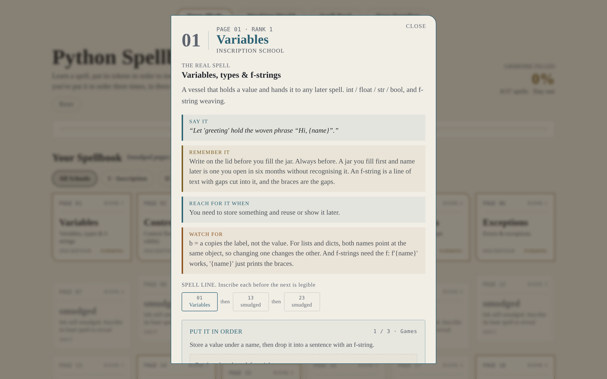

# Python Spellbook

A browser game for learning to write Python. You get an empty spellbook and fill it a page at a time. A page only fills in once you can write that line from memory in three different contexts, because recognizing code and being able to write it are not the same skill.

Play it in your browser: [bmallegri.github.io/python-spellbook](https://bmallegri.github.io/python-spellbook)


## How it works

Open a spell and you get the line in plain English, when to reach for it, and the exact way it goes wrong. The code arrives as scrambled tokens and you put them back in order, three times, in three different situations. There are 70 spells across two tracks, three projects, and a card battle where the script only compiles if you stack the lines in the order Python runs them.



## Run it locally

Needs Node 18 or newer.

```bash
git clone https://github.com/bmallegri/python-spellbook.git
cd python-spellbook
npm install
npm run dev
```

`npm test` and `npm run lint` check the content as well as the code. Progress saves to your browser, no account, no server. Reset is in the header.

## Adding a spell

All the content is one file, `src/content.js`, and nothing in it knows about React. A spell is one object plus three worked examples: three different situations, not one example reworded three times. `npm test` tells you if a spell is missing a hook or points at a prerequisite that isn't there.

## License

MIT. See [LICENSE](LICENSE). [design-history.md](design-history.md) is the longer version: what I tried, what I threw out, and what's still broken.
