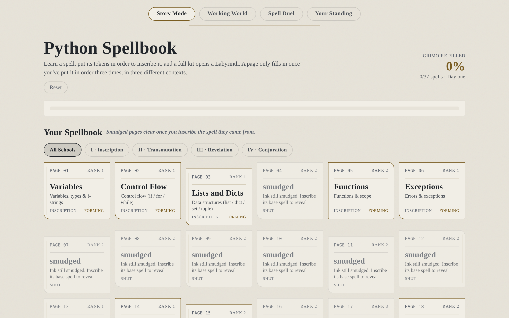

# Python Spellbook

A browser game for learning Python, where you get an empty spellbook and fill it a page at a time. A
page won't fill in until you can write that line from memory in three different contexts, because
recognising code and being able to write it are not the same skill.



## How it works

Open a spell and you get the line read aloud in plain English, when to reach for it, and the exact
way it goes wrong. Then the code arrives as scrambled tokens and you put them back in order, three
times, in three different situations. Collect a set of spells and a project opens up.

There are 70 spells across two tracks, three projects to build, and a card battle where each card is
a line of a program and the script only compiles if you stack them in the order Python runs them.

Your Standing tells you what the app believes about your grasp of each spell and what evidence it's
working from. It also says what it can't see, which is most of what matters.

## Run it locally

Needs Node 18 or newer.

```bash
git clone https://github.com/YOUR-USERNAME/python-spellbook.git
cd python-spellbook
npm install
npm run dev
```

That prints a local URL. The other scripts:

```bash
npm test      # content and render tests
npm run lint  # eslint
npm run build # production build into dist/
npm run preview  # serve the built site
```

Progress saves to your browser under `spellbook.save.v1`. No account, no server. Reset is in the
header and it clears the lot.

## Built with

React 18 and Vite, no UI framework and no icon set, with Vitest and ESLint on CI.

## Adding a spell

All the content is in `src/content.js` and nothing in that file knows about React. A spell is one
object:

```js
{ id: "yourid", name: "The Spell Name", school: "inscription", rank: 2, from: "someotherid",
  real: "What it actually is in Python",
  desc: "A sentence or two of explanation.",
  say:  "The line read aloud as plain English.",
  image:"A scene to remember the mechanism by.",
  when: "The real world trigger for reaching for it.",
  code: "the_real_code = 'here'",
  runes: ["the_real_code", "=", "'here'"],
  mission: "What to write in a real file.",
  gotcha: "The specific way this goes wrong." }
```

Add it to `SPELL`, then add three worked examples to `SPELL_HANDS` under the same `id`, each with
`ctx`, `code`, `note` and `runes`. Make them three different situations rather than one example
reworded three times, because the difference between them is the whole point. `from` is optional and
locks the spell until its parent is inscribed.

`npm test` checks the content as well as the code, so it'll tell you if a spell is missing a hook,
has the wrong number of worked examples, or points at a prerequisite that isn't there.

## What's next

- A live link, so you can play it without cloning anything
- The Working World never shows its `image` hook, so 33 written memory images have never been
  displayed to anyone
- Onboarding, which came out with the intro screen and hasn't found a home since
- More spells, and better `gotcha` lines on the ones that have weak ones

## Licence

MIT. See `LICENSE`.

`design-history.md` is the longer version: what I tried, what I threw out, and what's still broken.
